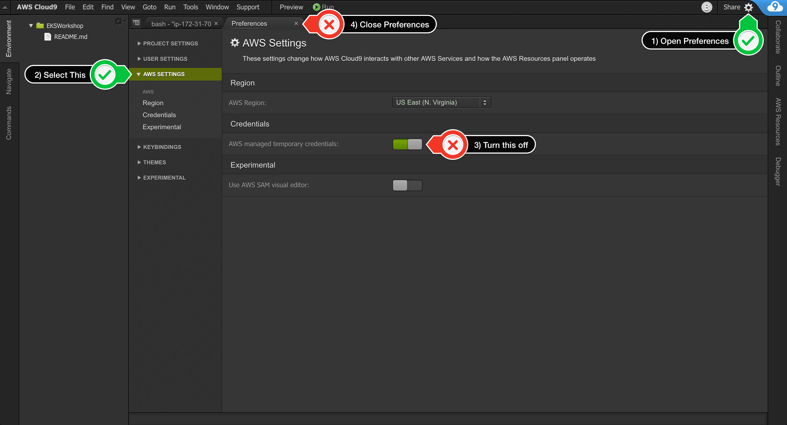
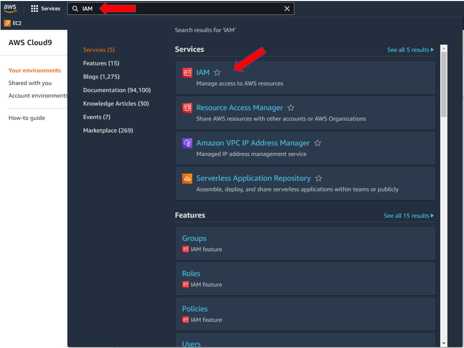
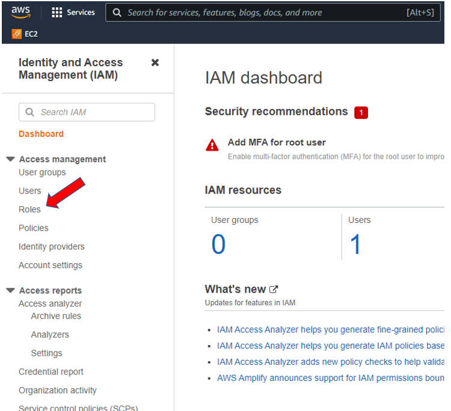
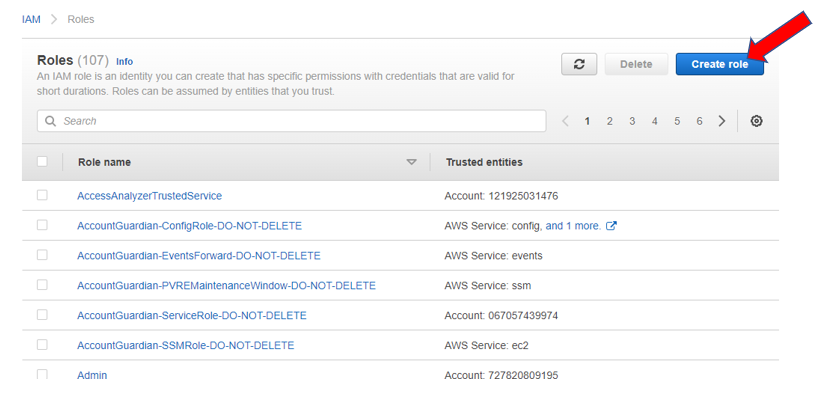
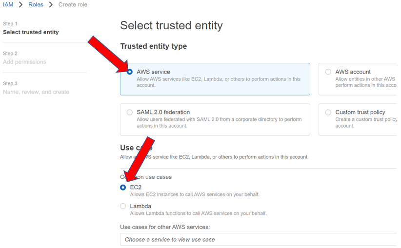
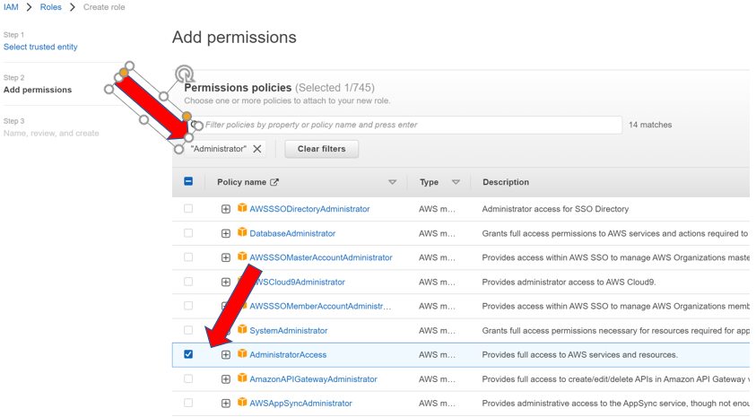
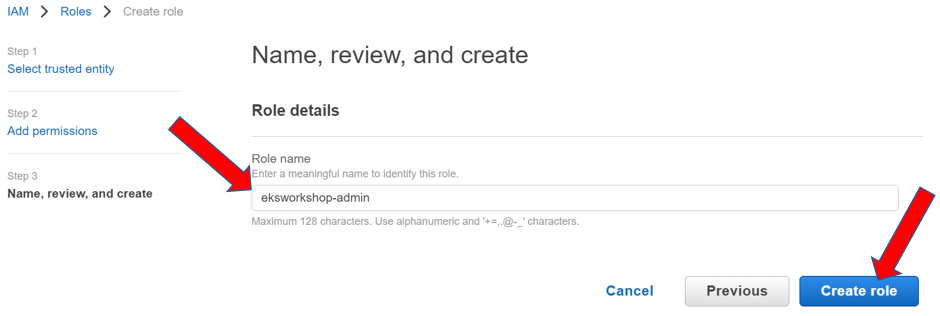
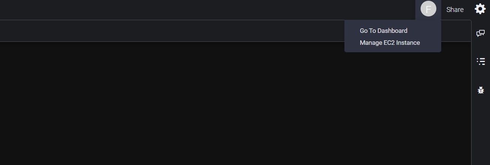
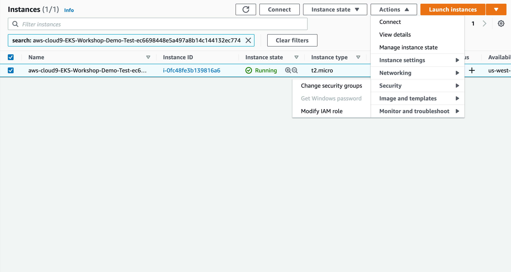
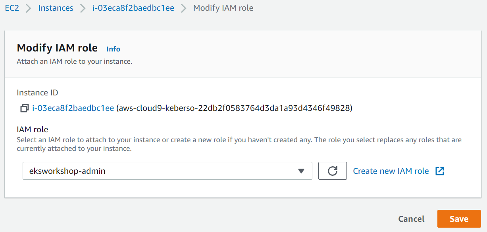

# Project Setup - Lab 0

This lab prepares your workspace to interact with AWS EKS by installing the required utilities. This configuration assumes you're using AWS Cloud9 and the lab has already been cloned to your Cloud9 Workspace per [here](../README.md).

## Preparation

1. Verify you're in the correct working directory of Lab 0:

    ```text
    cd aws-eks-workshop/0-setup
    ```

2. Execute the [setup.sh](./setup.sh) script on your workspace:

    ```bash
    chmod +x ./setup.sh
    ```

    ```bash
    ./setup.sh
    ```

    The [setup.sh](./setup.sh) script accomplishes the following:

    ```bash
    # Setup SSH Key
    ssh-keygen -t rsa -N "" -f ~/.ssh/id_rsa
    aws ec2 import-key-pair --key-name "eks-workshop" --public-key-material file://~/.ssh/id_rsa.pub
    
    # Install Dependencies
    sudo yum update -y
    sudo yum install -y jq gettext bash-completion moreutils
    curl -o aws-iam-authenticator https://amazon-eks.s3.us-west-2.amazonaws.com/1.21.2/2021-07-05/bin/linux/amd64/aws-iam-authenticator
    sudo mv -v aws-iam-authenticator /usr/local/bin/
    sudo chmod +x /usr/local/bin/aws-iam-authenticator
    
    # Set AWS Environment Variables
    export ACCOUNT_ID=$(aws sts get-caller-identity --output text --query Account) 
    export AWS_REGION=$(curl -s 169.254.169.254/latest/dynamic/instance-identity/document | jq -r '.region') 
    echo "export ACCOUNT_ID=${ACCOUNT_ID}" >> ~/.bash_profile 
    echo "export AWS_REGION=${AWS_REGION}" >> ~/.bash_profile 
    aws configure set default.region "${AWS_REGION}" 
    aws configure get default.region
    
    # Prepare for EC2 Role
    rm -vf "${HOME}/.aws/credentials"
    ```

## Attach EC2 Role to Cloud9 Workspace

1. Disable Cloud9 Temporary Credentials: 

2. Navigate to IAM:

    

3. Select "Roles":

    

4. Select "Create Role":

    

5. Select "AWS Service" and "EC2":

    

6. Filter on  "Administrator" and select "AdministratorAccess":

    

7. Name the role "eksworkshop-admin" and select "Create role":

    

8. Attach EC2 Role to Cloud9:

    Click Manage EC2 Instance in Cloud9 

    Click Actions -> Security -> Modify IAM Role 

    Attach the eksworkshop-admin role created previously to the instance and select "Save" 

9. Return to Cloud9 Workspace in the AWS Console.
