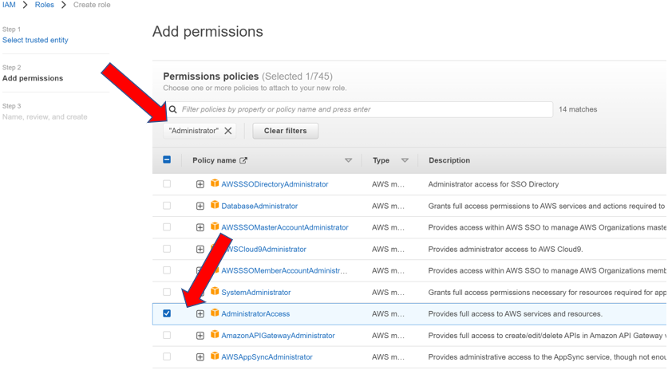

# Project Setup - Lab 0

This lab prepares your Cloud9 Development Environment to interact with AWS EKS by configuring and installing the required utilities. 

## Build Cloud9 Development Enviornment

1. Browse and launch Cloud9: 

    

2. Select "Create Environment": 

    

3. Name the new environment "eksworkshop" and select "Next step": 

    

4. Choose “t3.small” for instance type, take all default values and click “Next step”: 

    

5. Select “Create environment”: 

    

## Create and Configure EC2 Role

1. Disable Cloud9 Temporary Credentials: 

    

2. Navigate to IAM:

    

3. Select "Roles":

    

4. Select "Create Role":

    

5. Select "AWS Service" and "EC2":

    

6. Filter on  "Administrator" and select "AdministratorAccess":

    

7. Name the role "eksworkshop-admin" and select "Create role":

    

8. Attach EC2 Role to Cloud9:

    Click Manage EC2 Instance in Cloud9 

    Click Actions -> Security -> Modify IAM Role 

    Attach the eksworkshop-admin role created previously to the instance and select "Save" 

9. Return to Cloud9 Workspace in the AWS Console.
