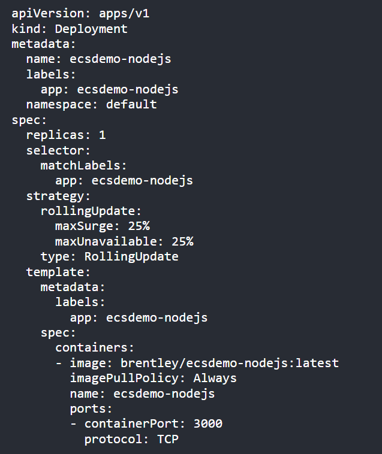
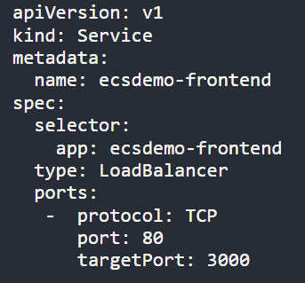
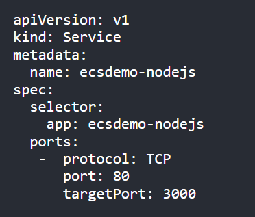
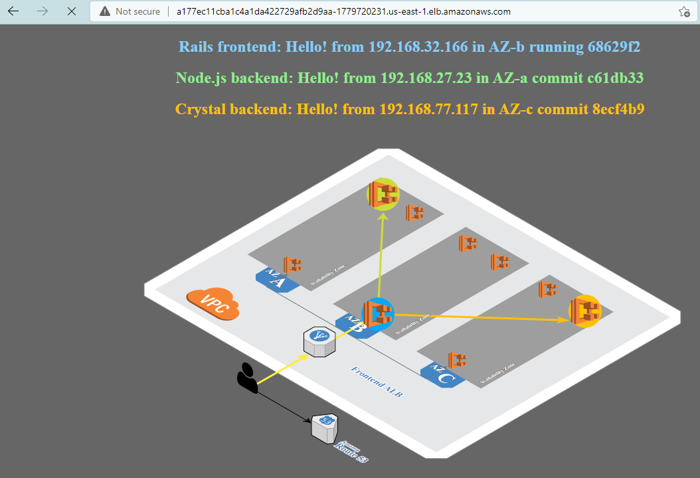

# Deploy Sample Microservices - Lab 5

In this file, we are defining our deployment. Remember earlier today, we said that Kubernetes is declarative. In this deployment file, we declare what we want to deploy. We then write this definition to the Kubernetes api using kubectl and Kubernetes works to both get and keep us in the state which we define. 



Remember from our earlier discussion, that a deployment declares what our application should look like and a service declares how other things in the cluster gain access to the application.

## Deploy the NodeJS Backend API/Application

1. Change directories to where our deployment and service definitions for the NodeJS application and service are located:

    ```bash
    cd ~/environment/ecsdemo-nodejs
    ```
2. Run the following commands to deploy the NodeJS service:

    ```bash
    kubectl apply -f kubernetes/deployment.yaml
    kubectl apply -f kubernetes/service.yaml
    ```
3. Run the following commands to see the deployment status:

    ```bash
    kubectl get deployment ecsdemo-nodejs
    ```
## Deploy Cyrstal Backend API/Application

1. Change directories to where our deployment and service definitions for the NodeJS application and service are located:

    ```bash
    cd ~/environment/ecsdemo-crystal
    ```

2. Run the following commands to deploy the Crystal service:

    ```bash
    kubectl apply -f kubernetes/deployment.yaml
    kubectl apply -f kubernetes/service.yaml
    ```
3. Run the following commands to see the deployment status:

    ```bash
    kubectl get deployment ecsdemo-crystal
    ```
## Deploy Frontend Service

Before we bring up the frontend service, let’s take a look at the service types we are using. 

This is kubernetes/service.yaml for our frontend service:



Notice type: LoadBalancer: This will configure an ELB to handle incoming traffic to this service.

Compare this to kubernetes/service.yaml for one of our backend services:



Notice there is no specific service type described. When we check the [Kubernetes documentation](https://kubernetes.io/docs/concepts/services-networking/service/#publishing-services-service-types
), we find that the default type is ClusterIP. This Exposes the service on a cluster-internal IP. Choosing this value makes the service only reachable from within the cluster.

Lets deploy the front end service.....

1. Ensure the ELB serice role exists. We can check for the role and create it if it is missing with the command below:

    ```bash
    aws iam get-role --role-name "AWSServiceRoleForElasticLoadBalancing" || aws iam create-service-linked-role --aws-service-name "elasticloadbalancing.amazonaws.com"
    ```

2. Change directories to where our deployment and service definitions for the front end application and service are located:

    ```bash
    cd ~/environment/ecsdemo-frontend
    ```
3. Run the following commands to deploy the Ruby front end:

    ```bash
    kubectl apply -f kubernetes/deployment.yaml
    kubectl apply -f kubernetes/service.yaml
    ```
4. Run the following commands to see the deployment status:

    ```bash
    kubectl get deployment ecsdemo-frontend
    ```
## Find the Service Address

1. Now that we have a running service that is type: LoadBalancer, we need to find the ELB’s address. We can do this by using the get services operation of kubectl:

    ```bash
    kubectl get service ecsdemo-frontend -o wide
    ```
2. (Optional)f we wanted to use the data programatically, we can also output via json. This is an example of how we might be able to make use of json output:

    ```bash
    ELB=$(kubectl get service ecsdemo-frontend -o json | jq -r '.status.loadBalancer.ingress[].hostname')
    curl -m3 -v $ELB
    ```
    Note: It will take several minutes for the ELB to become healthy and start passing traffic to the frontend pods.

3. Use the url outputed from step 2 and paste it into your browser.



## Scale the Back End Application

1. When we launched our services, we only launched one container of each. We can confirm this by viewing the running pods:

    ```bash
    kubectl get deployments
    ```
2. Scale up the backend services:

    ```bash
    kubectl scale deployment ecsdemo-nodejs --replicas=3
    kubectl scale deployment ecsdemo-crystal --replicas=3
    ```
3. Confirm by looking at deployments again:

    ```bash
    kubectl get deployments
    ```

    Note: Also, check the browser tab where we can see our application running. You should now see traffic flowing to multiple backend services.

## Scale the Front End Application

1. Scale up the front end services:

    ```bash
    kubectl scale deployment ecsdemo-frontend --replicas=3
    ```
2. Confirm by looking at deployments again:

    ```bash
    kubectl get deployments
    ```

    Note: Also, check the browser tab where we can see our application running. You should now see traffic flowing to multiple backend services.

## Contgratulations!
   You have created and scaled your first Kubernetes service! 
