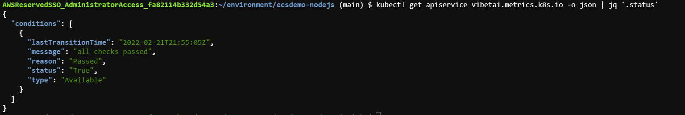

# Autoscaling Applications and Clusters - Lab 6

Before starting to learn about the various auto-scaling options for your EKS cluster we are going to install Kube-ops-view from Henning Jacobs.

Kube-ops-view provides a common operational picture for a Kubernetes cluster that helps with understanding our cluster setup in a visual way.

We will use Helm for the deployment. Helm is a package manager for Kubernetes that packages multiple Kubernetes resources into a single logical deployment unit called a Chart. Charts are easy to create, version, share, and publish.

## Install Helm CLI

1. Install Helm command line tools:

    ```bash
    curl -sSL https://raw.githubusercontent.com/helm/helm/master/scripts/get-helm-3 | bash
    ```
2. Verify the Helm version:

    ```bash
    helm version --short
    ```
3. Download the stable respository:

    ```bash
    helm repo add stable https://charts.helm.sh/stable
    ```

4. Configure Bash completion for the helm command:

    ```bash
    helm completion bash >> ~/.bash_completion
    . /etc/profile.d/bash_completion.sh
    . ~/.bash_completion
    source <(helm completion bash)
    ```

## Install kube-ops-view 

1. The following line updates the stable helm repository and then installs kube-ops-view using a LoadBalancer Service type and creating a RBAC (Resource Base Access Control) entry for the read-only service account to read nodes and pods information from the cluster:

    ```bash
    helm install kube-ops-view \
    stable/kube-ops-view \
    --set service.type=LoadBalancer \
    --set rbac.create=True
    ```
    Note: The execution above installs kube-ops-view exposing it through a Service using the LoadBalancer type. A successful execution of the command will display the set of resources created and will prompt some advice asking you to use kubectl proxy and a local URL for the service. Given we are using the type LoadBalancer for our service, we can disregard this; Instead we will point our browser to the external load balancer.

2. Run the following command to verify that chart was installed succesfully:

    ```bash
    helm list
    ```
3. Run the following command to get the URL for kube-ops-view:

    ```bash
    kubectl get svc kube-ops-view | tail -n 1 | awk '{ print "Kube-ops-view URL = http://"$4 }'
    ```
    Note: As this workshop moves along and you perform scale up and down actions, you can check the effects and changes in the cluster using kube-ops-view. Check out the different components and see how they map to the concepts that we have already covered during this workshop.

## Deploy Kubernetes Metrics Server

Note: Metrics Server is a scalable, efficient source of container resource metrics for Kubernetes built-in autoscaling pipelines.

These metrics will drive the scaling behavior of the deployments.

1. The following command will deploy the kubernetes metrics server using kubectl:

    ```bash
    kubectl apply -f https://github.com/kubernetes-sigs/metrics-server/releases/download/v0.5.0/components.yaml
    ```
2. Run the following command to verify the status of the metrics-server APIService (It could take a few minutes):

    ```bash
    kubectl get apiservice v1beta1.metrics.k8s.io -o json | jq '.status'
    ```
    Sample Output:
    

## Deploy a Sample App

We will deploy an application and expose as a service on TCP port 80.

The application is a custom-built image based on the php-apache image. The index.php page performs calculations to generate CPU load. More information [can be found here](https://kubernetes.io/docs/tasks/run-application/horizontal-pod-autoscale-walkthrough/#run-expose-php-apache-server)

1. Deploy the custom application:

    ```bash
    kubectl create deployment php-apache --image=us.gcr.io/k8s-artifacts-prod/hpa-example
    kubectl set resources deploy php-apache --requests=cpu=200m
    kubectl expose deploy php-apache --port 80
    ```
2. List the php-apache pod:

    ```bash
    kubectl get pod -l app=php-apache
    ```

## Create a HPA Resource

1. Run the commands below to create and HPA resource that sclaes up when CPU exceeds 50% of the allocated container resource:

    ```bash
    kubectl autoscale deployment php-apache `#The target average CPU utilization` \
      --cpu-percent=50 \
      --min=1 `#The lower limit for the number of pods that can be set by the autoscaler` \
      --max=10 `#The upper limit for the number of pods that can be set by the autoscaler`
    ```
2. View the HPA using kubectl. You will see <unknown>/50% for 1-2 minutes and then you should be able to see 0%/50%:

    ```bash
    kubectl get hpa
    ```