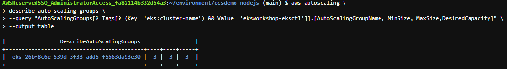
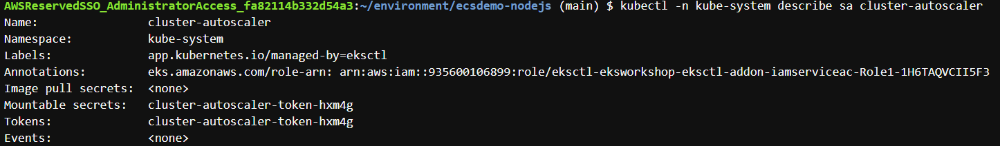

# Autoscaling Clusters - Lab 7

Cluster Autoscaler for AWS provides integration with Auto Scaling groups. It enables users to choose from four different options of deployment:

One Auto Scaling group
Multiple Auto Scaling groups
Auto-Discovery
Control-plane Node setup
Auto-Discovery is the preferred method to configure Cluster Autoscaler. [Click here for more information.](https://github.com/kubernetes/autoscaler/tree/master/cluster-autoscaler/cloudprovider/aws)

Cluster Autoscaler will attempt to determine the CPU, memory, and GPU resources provided by an Auto Scaling Group based on the instance type specified in its Launch Configuration or Launch Template.

## Configure the Auto Scaling group by setting the minimum, maximum and desired capacity. When we created the cluster we set these settings to 3.

1. Describe the current auto scaling group:

    ```bash
    aws autoscaling \
    describe-auto-scaling-groups \
    --query "AutoScalingGroups[? Tags[? (Key=='eks:cluster-name') && Value=='eksworkshop-eksctl']].[AutoScalingGroupName, MinSize, MaxSize,DesiredCapacity]" \
    --output table
    ```
    Sample Output:
    

2. Increase the maximum capacity to 4 instances and check the new values:
    
    ```bash
    # we need the ASG name
    export ASG_NAME=$(aws autoscaling describe-auto-scaling-groups --query "AutoScalingGroups[? Tags[? (Key=='eks:cluster-name') && Value=='eksworkshop-eksctl']].AutoScalingGroupName" --output text)

    # increase max capacity up to 4
    aws autoscaling \
      update-auto-scaling-group \
      --auto-scaling-group-name ${ASG_NAME} \
      --min-size 3 \
      --desired-capacity 3 \
      --max-size 4

    # Check new values
    aws autoscaling \
      describe-auto-scaling-groups \
      --query "AutoScalingGroups[? Tags[? (Key=='eks:cluster-name') && Value=='eksworkshop-eksctl']].[AutoScalingGroupName, MinSize, MaxSize,DesiredCapacity]" \
      --output table
    ```
## IAM Roles for Service Accounts (IRSA)

Note: [Click here](https://www.eksworkshop.com/beginner/110_irsa/) if you would like more information for IAM Roles for Service Accounts.

With IAM roles for service accounts on Amazon EKS clusters, you can associate an IAM role with a Kubernetes service account. This service account can then provide AWS permissions to the containers in any pod that uses that service account. With this feature, you no longer need to provide extended permissions to the node IAM role so that pods on that node can call AWS APIs.

1. Associate IAM OIDC Provider with your Cluster:

    ```bash
    eksctl utils associate-iam-oidc-provider \
    --cluster eksworkshop-eksctl \
    --approve
    ```
2. Creating an IAM policy for your service account that will allow your CA pod to interact with the autoscaling groups:

    ```bash
    mkdir ~/environment/cluster-autoscaler

    cat <<EoF > ~/environment/cluster-autoscaler/k8s-asg-policy.json
    {
        "Version": "2012-10-17",
        "Statement": [
            {
                "Action": [
                    "autoscaling:DescribeAutoScalingGroups",
                    "autoscaling:DescribeAutoScalingInstances",
                    "autoscaling:DescribeLaunchConfigurations",
                    "autoscaling:DescribeTags",
                    "autoscaling:SetDesiredCapacity",
                    "autoscaling:TerminateInstanceInAutoScalingGroup",
                    "ec2:DescribeLaunchTemplateVersions"
                ],
                "Resource": "*",
                "Effect": "Allow"
            }
        ]
    }
    EoF

    aws iam create-policy   \
        --policy-name k8s-asg-policy \
        --policy-document file://~/environment/cluster-autoscaler/k8s-asg-policy.json
    ```

3. Create and IAM role for the cluster-autoscaler Service Account in the kube-system namespsce:

    ```bash
    eksctl create iamserviceaccount \
        --name cluster-autoscaler \
        --namespace kube-system \
        --cluster eksworkshop-eksctl \
        --attach-policy-arn "arn:aws:iam::${ACCOUNT_ID}:policy/k8s-asg-policy" \
        --approve \
        --override-existing-serviceaccounts
    ```
4. Verify that your service account with the ARN of the IAM role is annotated:

    ```bash
    kubectl -n kube-system describe sa cluster-autoscaler
    ```
    Sample Output:
    

## Deploy the Cluster Autoscaler (CA)

1. Deploy the Cluster Autoscaler to your cluster with the following command:

    ```bash
    kubectl apply -f https://www.eksworkshop.com/beginner/080_scaling/deploy_ca.files/cluster-autoscaler-autodiscover.yaml
    ```
2. To prevent CA from removing nodes where its own pod is running, we will add the cluster-autoscaler.kubernetes.io/safe-to-evict annotation to its deployment with the following command:

    ```bash
    kubectl -n kube-system \
    annotate deployment.apps/cluster-autoscaler \
    cluster-autoscaler.kubernetes.io/safe-to-evict="false"
    ```
3. Update the autoscaler image with the following command:

    ```bash
    # we need to retrieve the latest docker image available for our EKS version
    export K8S_VERSION=$(kubectl version --short | grep 'Server Version:' | sed 's/[^0-9.]*\([0-9.]*\).*/\1/' | cut -d. -f1,2)
    export AUTOSCALER_VERSION=$(curl -s "https://api.github.com/repos/kubernetes/autoscaler/releases" | grep '"tag_name":' | sed -s 's/.*-\([0-9][0-9\.]*\).*/\1/' | grep -m1 ${K8S_VERSION})

    kubectl -n kube-system \
        set image deployment.apps/cluster-autoscaler \
        cluster-autoscaler=us.gcr.io/k8s-artifacts-prod/autoscaling/cluster-autoscaler:v${AUTOSCALER_VERSION}
    ```
4. Use the following command to watch the CA logs:

    ```bash
    kubectl -n kube-system logs -f deployment/cluster-autoscaler
    ```

## Scale the Cluster with Cluster Autoscaler (CA)

1. Deploy sample nginx application as a ReplicaSet of 1 Pod:

    ```bash
    cat <<EoF> ~/environment/cluster-autoscaler/nginx.yaml
    apiVersion: apps/v1
    kind: Deployment
    metadata:
    name: nginx-to-scaleout
    spec:
    replicas: 1
    selector:
        matchLabels:
        app: nginx
    template:
        metadata:
        labels:
            service: nginx
            app: nginx
        spec:
        containers:
        - image: nginx
            name: nginx-to-scaleout
            resources:
            limits:
                cpu: 500m
                memory: 512Mi
            requests:
                cpu: 500m
                memory: 512Mi
    EoF

    kubectl apply -f ~/environment/cluster-autoscaler/nginx.yaml

    kubectl get deployment/nginx-to-scaleout
    ```