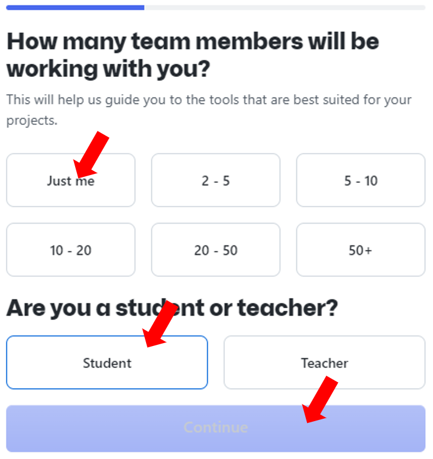
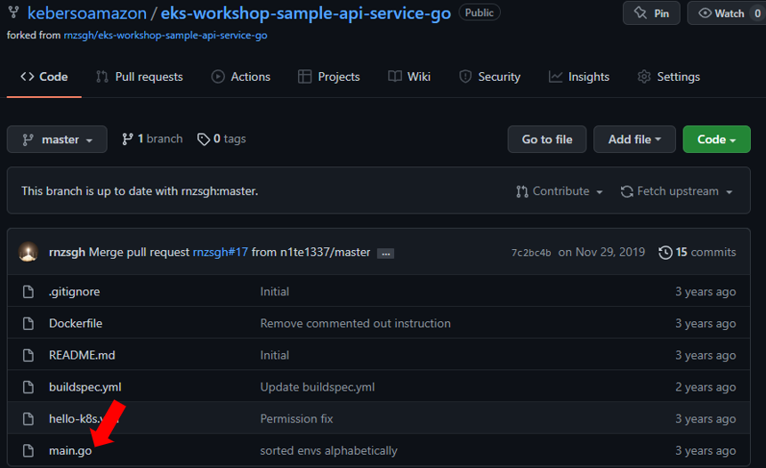

# CI/CD with AWS CodePipeline - Lab 8 (Optional)

Continuous integration (CI) and continuous delivery (CD) are essential for deft organizations. Teams are more productive when they can make discrete changes frequently, release those changes programmatically and deliver updates without disruption.

In this module, we will build a CI/CD pipeline using AWS CodePipeline. The CI/CD pipeline will deploy a sample Kubernetes service, we will make a change to the GitHub repository and observe the automated delivery of this change to the cluster.

## Signup for a GitHub Account

1. [Visit GitHub](https://github.com/)

2. Click "Signup"

    

3. Enter your e-mail and select "Continue"

    

3. Create a password and select "Continue"

    

4. Enter and username and select "Continue"

    

5. Type "n" to not recieve product updates and annoucements and select "Continue"

    

6. Select "Create account"

    

Note: You will recive an launch code to the e-mail you specified. Enter the code.

7. Select "Just me", "Student" and select "Continue"

    

    Note: Skip all personalization’s.

## Create IAM Role

In an AWS CodePipeline, we are going to use AWS CodeBuild to deploy a sample Kubernetes service. This requires an AWS Identity and Access Management (IAM) role capable of interacting with the EKS cluster.

In this step, we are going to create an IAM role and add an inline policy that we will use in the CodeBuild stage to interact with the EKS cluster via kubectl.

1. Create the role by running the following command:

    ```bash
    cd ~/environment

    TRUST="{ \"Version\": \"2012-10-17\", \"Statement\": [ { \"Effect\": \"Allow\", \"Principal\": { \"AWS\": \"arn:aws:iam::${ACCOUNT_ID}:root\" }, \"Action\": \"sts:AssumeRole\" } ] }"

    echo '{ "Version": "2012-10-17", "Statement": [ { "Effect": "Allow", "Action": "eks:Describe*", "Resource": "*" } ] }' > /tmp/iam-role-policy

    aws iam create-role --role-name EksWorkshopCodeBuildKubectlRole --assume-role-policy-document "$TRUST" --output text --query 'Role.Arn'

    aws iam put-role-policy --role-name EksWorkshopCodeBuildKubectlRole --policy-name eks-describe --policy-document file:///tmp/iam-role-policy
    ```

    Now that we have the IAM role created, we are going to add the role to the aws-auth ConfigMap for the EKS cluster.

    Once the ConfigMap includes this new role, kubectl in the CodeBuild stage of the pipeline will be able to interact with the EKS cluster via the IAM role.

2. To add the role to the aws-auth ConfigMap for your cluster, run the following command:

    ```bash
    cd ~/environment

    ROLE="    - rolearn: arn:aws:iam::${ACCOUNT_ID}:role/EksWorkshopCodeBuildKubectlRole\n      username: build\n      groups:\n        - system:masters"

    kubectl get -n kube-system configmap/aws-auth -o yaml | awk "/mapRoles: \|/{print;print \"$ROLE\";next}1" > /tmp/aws-auth-patch.yml

    kubectl patch configmap/aws-auth -n kube-system --patch "$(cat /tmp/aws-auth-patch.yml)"
    ```

## Fork the Sample Repository

We are now going to fork the sample Kubernetes service so that we will be able modify the repository and trigger builds.

1. Login to your new GitHub account using the account created above

2. As shown below, [Click here](https://github.com/rnzsgh/eks-workshop-sample-api-service-go) and select fork:

    


Once the repo is forked, you can view it in your your GitHub repositories.

The forked repo will look like:


## Generate GitHub Access Token

In order for CodePipeline to receive callbacks from GitHub, we need to generate a personal access token.

Once created, an access token can be stored in a secure enclave and reused, so this step is only required during the first run or when you need to generate new keys.

1. Open your GitHub account and [Click here](https://github.com/settings/tokens/new)

    

2. Enter eks-workshop for Token description, check the repo permission scope and scroll down and click the Generate token button

    

   Copy the personal access token and save it in a secure place for the next step...

## AWS CodePipeline Setup

Now we are going to create the AWS CodePipeline using AWS CloudFormation.

CloudFormation is an infrastructure as code (IaC) tool which provides a common language for you to describe and provision all the infrastructure resources in your cloud environment. CloudFormation allows you to use a simple text file to model and provision, in an automated and secure manner, all the resources needed for your applications across all regions and accounts.

Each EKS deployment/service should have its own CodePipeline and be located in an isolated source repository.

You can modify the CloudFormation templates provided with this workshop to meet your system requirements to easily onboard new services to your EKS cluster. For each new service the following steps can be repeated.

1. Ensure that you are logged into your AWS account

2. [Click here](https://console.aws.amazon.com/cloudformation/home?#/stacks/create/review?stackName=eksws-codepipeline&templateURL=https://s3.amazonaws.com/eksworkshop.com/templates/main/ci-cd-codepipeline.cfn.yml) to create the CloudFormation stack in the AWS Management Console.

3. After the console is open, enter your GitHub username, personal access token (created in previous step), check the " I acknowledge that AWS CloudFormation might create IAM resources" check box and then click the “Create stack” button located at the bottom of the page.

    

    Wait for the status to change from “CREATE_IN_PROGRESS” to CREATE_COMPLETE before moving on to the next step.


3. Open CodePipeline in the Management Console. You will see a CodePipeline that starts with eks-workshop-codepipeline. [Click this link](https://console.aws.amazon.com/codesuite/codepipeline/pipelines) to view the details.

    Note: If you receive a permissions error similar to User x is not authorized to perform: codepipeline:ListPipelines… upon clicking the above link, the CodePipeline console may have opened up in the wrong region. To correct this, from the Region dropdown in the console, choose the region you provisioned the workshop in (N. Virginia (US-EAST-1)).


5. Select the pipeline that starts with eks-workshop-codepipeline.

    Note: Once you are on the detail page for the specific CodePipeline, you can see the status along with links to the change and build details.


6. To review the status of the Kubernetes deployment, go back to your Cloud9 environment and run the following command:

    ```bash
    kubectl describe deployment hello-k8s
    ```

    Note: Once the service is built and delivered, we can run the following command to get the Elastic Load Balancer (ELB) endpoint and open it in a browser. If the message is not updated immediately, give Kubernetes some time to deploy the change.

    ```bash
    kubectl get services hello-k8s -o wide
    ```

## Trigger a New Release

So far we have walked through setting up CI/CD for EKS using AWS CodePipeline and now we are going to make a change to the GitHub repository so that we can see a new release built and delivered.

1. [Open GitHub](https://github.com/) and select the forked repository with the name eks-workshop-sample-api-service-go.


2. Double click on main.go file 




3. Click on the edit button, which looks like a pencil.


4. Change the text where it says “Hello World”, add a commit message and then click the “Commit changes” button.

