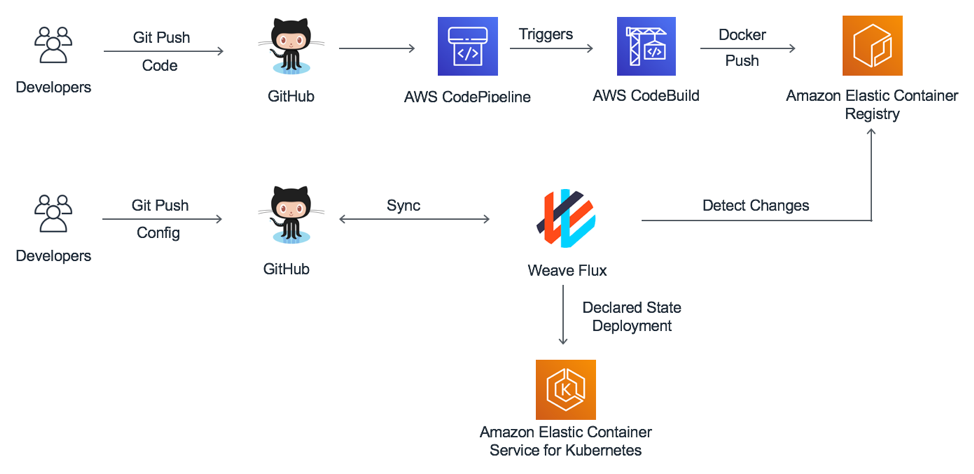

# GitOps with Weave Flux - Lab 7

GitOps, a term coined by Weaveworks, is a way to do continuous delivery. Git is used as single source of truth for deploying into your cluster. This is easy for a development team as they are already familiar with git and do not need to know other tools. Weave Flux is a tool that runs in your Kubernetes cluster and implements changes based on monitoring Git and image repositories.

In this module, we will create a Docker image build pipeline using AWS CodePipeline for a sample application in a GitHub repository. We will then commit Kubernetes manifests to GitHub and monitor Weave Flux managing the deployment.

Below is a diagram of what will be created:

    Sample Output:
    