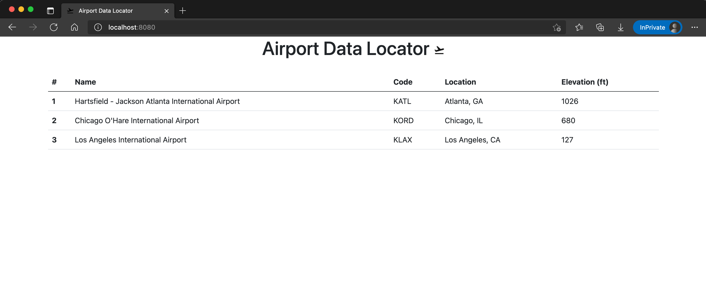

# AWS Elastic Kubernetes Service (EKS) Workshop

## [Project Setup - Lab 0](./0-setup)

Build your Cloud9 Development Environment.

## [Install Kubernetes Tools - Lab 1](./1-install-kubernetes-tools)

Install Kubernetes tools into your Cloud9 Development Enviornment.

## [Preparing EKS Cluster for Applications - Lab 2](./2-preparing-eks-cluster )

Execute the following:

* Verify AWS Load Balancer IAM roles for service account is configured
* Deploy AWS Load Balancer Controller for external connectivity
* Deploy official Kubernetes dashboard

## [Containerize Tomcat Web Application - Lab 3](./3-containerize-web-application)

Securely containerize a Java Spring Boot MVC application with Tomcat Servlet for deployment into the cluster. Push containerized application to AWS Elastic Container Registry (ECR).

## [Deploying Application to EKS Cluster - Lab 4](./4-deploying-application-into-eks)

Deploy the above containerized application from ECR into the newly formed EKS cluster.

## [Update Deployment on EKS Cluster - Lab 5](./5-update-application-deployment)

Update the containerized application by adding additional airports then containerizes a new version for upload to ECR.
